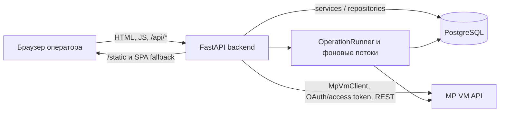

# Архитектура системы MP VM Client

Этот документ описывает фактически реализованную архитектуру текущего приложения. Правила развития и переходные архитектурные соглашения вынесены в отдельный документ [ARCHITECTURE.md](./ARCHITECTURE.md).

## Назначение

MP VM Client — операторское web-приложение для работы с внешней системой MP VM. Оно объединяет в одном интерфейсе:

- подключение и авторизацию в MP VM;
- создание, проверку, запуск и остановку задач сканирования;
- наблюдение за удалённым сканированием и локальную постобработку результатов;
- построение и хранение карточек активов;
- локальную аналитику уязвимостей и паспортов;
- очередь устранения, SLA, подтверждение результата и покрытие повторными проверками;
- фоновые операции, автоматизации, диагностику и экспорт.

Приложение рассчитано на single-instance запуск: одна копия backend владеет процессной сессией MP VM, пулами потоков и токенами отмены. Долговечное состояние хранится в PostgreSQL.

## Контекст и компоненты

### Frontend

Frontend реализован на React и собирается Vite. Production-сборка находится в `app/static`: FastAPI отдаёт `/static/*`, корневой `index.html` и SPA fallback для остальных не-API путей.

Основные части:

- [`src/app/App.jsx`](../src/app/App.jsx) — корневой shell, проверка сессии и выбор страницы;
- [`src/app/navigation.js`](../src/app/navigation.js) — маршруты, требуемые разрешения и операторские этапы workflow;
- [`src/app/router.js`](../src/app/router.js) — history-based маршрутизация без отдельного router-пакета;
- [`src/app/useAppData.js`](../src/app/useAppData.js) и [`src/app/providers.jsx`](../src/app/providers.jsx) — server state через TanStack Query, polling состояния системы и операций;
- [`src/api/client.js`](../src/api/client.js) — единый HTTP-клиент, `X-Request-ID`, обработка `X-Trace-ID`, нормализация ошибок и загрузка файлов.

Состояние системы опрашивается каждые 10 секунд. Сводка операций опрашивается каждые 2 секунды при активных операциях и каждые 15 секунд в спокойном состоянии. Роуты скрываются или блокируются согласно permission-контракту из `navigation.js`, но окончательная авторизация всегда выполняется backend.

### Backend

Backend — FastAPI-приложение, создаваемое фабрикой [`app/factory.py`](../app/factory.py) и конфигурируемое в [`app/main.py`](../app/main.py). `app.main` остаётся главным композиционным модулем: в нём находятся часть HTTP handlers и значительная часть orchestration сканирования, карточек и фоновых jobs.

[`AppContainer`](../app/core/container.py) владеет процессными ресурсами:

- одной `RuntimeSession` для текущего соединения с MP VM;
- наборами репозиториев и сервисов;
- `OperationRunner` с именованными `ThreadPoolExecutor`;
- семафорами, ограничивающими параллельные запросы к MP VM;
- процессным кэшем метаданных активов.

Модульные API-срезы находятся в [`app/api`](../app/api), сервисы — в [`app/services`](../app/services), репозитории — в [`app/repositories`](../app/repositories). Часть репозиториев пока делегирует функции большому модулю [`app/db.py`](../app/db.py), поэтому фактическая архитектура является переходной, а не полностью разделённой по доменам.

### PostgreSQL

PostgreSQL — источник долговечного локального состояния. Backend обращается к нему через `psycopg` и возвращает строки как словари. Схема обновляется Alembic-командой `upgrade head` при `db.init_db()`.

Основные группы данных:

- пользователи, роли, разрешения, сессии и аудит приложения;
- локальные копии scanner tasks;
- общий реестр операций и события операций;
- scan postprocess runs и поактивные items;
- карточки активов, дерево/коллекции, поисковые поля и уязвимости;
- паспорта уязвимостей, trends и jobs загрузки деталей;
- remediation cases, события, SLA policy, coverage и scan evidence;
- группы активов, VM workflows, автоматизации, уведомления и доставки webhook.

В Docker Compose PostgreSQL 16 использует именованный volume `mpvm_postgres`; backend начинает запуск после успешного `pg_isready`. Конфигурация находится в [`docker-compose.yml`](../docker-compose.yml).

### Внешняя MP VM

[`MpVmClient`](../app/mpvm_client.py) — совместимый facade к transport/auth слоям в [`app/mpvm`](../app/mpvm). Он выполняет OAuth/access-token авторизацию и REST-вызовы для asset grid, scanner tasks/runs/jobs, групп активов, дерева и метаданных активов, уязвимостей, паспортов и операций удаления.

HTTP session имеет явный timeout и retry adapter: до трёх повторов для connect/read/status ошибок, backoff `0.8`, статусы `429`, `500`, `502`, `503`, `504`, методы `GET`, `POST`, `PUT`, `DELETE`. Проверка TLS включена по умолчанию и управляется конфигурацией соединения.

Сессия MP VM является общей процессной сессией backend, а не отдельной сессией каждого пользователя приложения. Она может быть создана из `MPVM_*` переменных при старте или через `/api/session/connect`.

## Основные потоки

### 1. Запуск сканирования и postprocess

1. Frontend вызывает `POST /api/scanner-tasks/{task_id}/start` или VM workflow endpoint.
2. Backend проверяет idempotency key, загружает локальную конфигурацию задачи и перед удалённым запуском синхронизирует её с MP VM.
3. До или сразу после запуска создаётся долговечный `scan_postprocess_run`; тот же идентификатор регистрируется в общем реестре `operations`.
4. MP VM запускает scanner task. Backend ставит `run_scan_postprocess` в очередь `scan-postprocess`.
5. Worker получает lease на run, опрашивает task runs и jobs MP VM, игнорирует connection-check/host-discovery jobs и выбирает успешные scanner jobs.
6. Targets успешных jobs разрешаются в актуальные активы через MP VM asset grid. Для каждого уникального asset создаётся долговечный postprocess item.
7. Ограниченный пул `scan-asset-process` обрабатывает items; отдельный ограниченный пул разрешает targets. Состояние и счётчики сохраняются в PostgreSQL.
8. После завершения items run получает `completed`, `completed_with_errors`, `failed` или `cancelled`; обновляется scanner task, сохраняется scan evidence и создаётся snapshot уязвимостей.

Код потока сосредоточен в функциях `_start_scanner_task_request`, `schedule_scan_postprocess`, `run_scan_postprocess` и `monitor_successful_scan_jobs` в [`app/main.py`](../app/main.py). Долговечные lease/status операции находятся в [`app/db.py`](../app/db.py).

### 2. Обработка одного просканированного актива

Для каждого разрешённого актива `process_scanned_asset_item` выполняет последовательность:

1. делает до настроенного числа проб Docker container data;
2. строит и сохраняет локальную карточку актива;
3. запускает удаление этого актива в MP VM;
4. опрашивает удалённую операцию удаления до terminal state, timeout или отмены;
5. фиксирует `completed`, `build_failed`, `removal_failed` или `cancelled`.

> **Эксплуатационно важная граница:** успешная локальная постобработка включает удаление обработанного актива из MP VM после сохранения карточки. Сбой удаления не откатывает уже сохранённую локальную карточку; item завершается как `removal_failed`.

Автоматически созданная задача refresh scan и временная Docker-группа очищаются отдельно. Если cleanup не удался, его состояние сохраняется и cleanup повторяется после восстановления процесса.

### 3. Построение карточки актива

Карточка может строиться отдельным job (`POST /api/asset-cards/build-jobs`) или как дочерний шаг scan postprocess.

`AssetCardRequestExecutor` ограничивает и распараллеливает запросы к MP VM. Pipeline получает timeline token, корень и дерево объекта, метаданные, коллекции, табличные строки и источники уязвимостей, затем сохраняет нормализованную карточку и поисковые индексы в PostgreSQL.

Стадии (`starting`, `collecting`, `timeline`, `root`, `tree_and_vulnerabilities`, `assembling`, `saving`, `completed`) и прогресс сохраняются в `asset_card_build_jobs`. База не допускает несколько одновременно активных build jobs. После сохранения карточки backend:

- сверяет remediation cases для этого актива;
- для самостоятельной сборки создаёт snapshot уязвимостей;
- для scan postprocess передаёт управление шагу удаления актива из MP VM.

### 4. Уязвимости и паспорта

API `/api/vulnerabilities/*` читает локальные данные карточек через `VulnerabilityAnalyticsService` и `VulnerabilityAnalyticsRepository`. Доступны сводка, список агрегированных уязвимостей, затронутые hosts, trends и trending. Фильтры включают severity и источник `os`, `software`, `docker`.

Паспорта могут запрашиваться из MP VM и сохраняться локально. Job загрузки деталей использует ограниченный пул, отдельный `MpVmClient` на worker, пакетную запись и изолирует ошибки отдельных паспортов: итогом может быть `completed_with_errors`, а не полный отказ job.

### 5. Remediation и подтверждение результата

Remediation cases формируются из уязвимостей сохранённых карточек. Оператор может начать case из пары asset/vulnerability, назначить ответственного, срок, комментарий и временное исключение. Обновления используют `expected_version`; конфликт конкурентного изменения возвращается как version conflict.

Статус `resolved` нельзя назначить вручную через service. `reconcile_asset` вызывается после сохранения новой карточки и при старте приложения; он создаёт, переоткрывает или закрывает cases в соответствии с актуальными findings. Таким образом, подтверждение устранения зависит от полного refresh карточки и отсутствия finding в новых данных.

SLA policy хранится в PostgreSQL. Просроченные risk acceptance/false-positive исключения автоматически возвращаются в `open`. Coverage использует сохранённое scan evidence и состояние карточек.

## HTTP API

Все доменные routers объединяются в [`app/api/routers.py`](../app/api/routers.py). Основные группы:

| Область | Основные пути | Назначение |
|---|---|---|
| Auth/RBAC | `/api/auth/*` | login/logout, users, roles, permissions, audit |
| Состояние | `/api/health`, `/api/system/status`, `/api/defaults` | readiness/degraded state и runtime limits |
| MP VM session | `/api/session/*`, `/api/mpvm/lookups` | подключение, отключение, справочники |
| Scanner tasks | `/api/scanner-tasks/*`, `/api/mpvm/scanner-tasks/remote` | CRUD, validate, start/stop, результаты и postprocess |
| Operations | `/api/operations/*` | единый список, сводка, cancel, retry, diagnostics |
| Assets/cards | `/api/assets/*`, `/api/asset-cards/*`, `/api/asset-card-query/*` | локальные findings, карточки, refresh и запросы |
| Vulnerabilities | `/api/vulnerabilities/*`, `/api/vulnerability-passports/*` | аналитика, trends, passports и detail jobs |
| Remediation/risk | `/api/remediation/*`, `/api/coverage/*`, `/api/risk/*` | cases, SLA, coverage, risk queue и campaigns |
| VM workflows | `/api/vm/*` | устойчивый родительский scan/verification workflow |
| Automation | `/api/automations/*`, `/api/notifications/*` | runbooks, schedules, runs и уведомления |
| Прочее | `/api/asset-groups/*`, compliance/report, import/export, diagnostics | группы, отчёты, CSV и диагностика |

Pydantic DTO для legacy handlers собраны в [`app/api/schemas.py`](../app/api/schemas.py); модульные routers определяют часть DTO рядом с handlers.

### Аутентификация и трассировка

Публичны только login, bootstrap status и health. Остальные `/api/*` запросы требуют cookie-сессию приложения, после чего middleware сопоставляет method/path с permission и выполняет RBAC-проверку. Небезопасные cross-site запросы отклоняются по `Sec-Fetch-Site`.

Diagnostic middleware назначает или принимает `X-Request-ID` и `X-Trace-ID`, добавляет их в ответ вместе с `Server-Timing` и пишет структурированные события. Frontend сохраняет trace ID и включает его в операторское сообщение об ошибке.

## Фоновые задачи и долговечность

`OperationRunner` создаёт именованные `ThreadPoolExecutor` по требованию и хранит cooperative cancellation events в памяти процесса. Основные очереди:

- `scan-postprocess`;
- `docker-group-cleanup`;
- `vm-workflow`;
- `asset-card-bulk-refresh`;
- `automation-run` и `automation-scheduler`;
- дополнительная одиночная очередь `maintenance`, не имеющая отдельного worker limit.

Внутри jobs используются дополнительные ограниченные пулы для MP VM requests, target resolution, asset processing и passport details. Общий `BoundedSemaphore` ограничивает суммарное число фоновых MP VM запросов.

PostgreSQL хранит status, stage, progress, request/result и ошибки. После рестарта:

- активные asset-card build jobs и passport-detail jobs переводятся в interrupted;
- leases scan postprocess освобождаются, незавершённые items возвращаются в очередь, а resumable runs запускаются повторно при наличии MP VM session;
- ожидающие cleanup временных задач и Docker-групп возобновляются;
- автоматизации и VM workflows имеют собственную логику resume;
- in-memory futures, clients, caches и cancellation events не переживают рестарт.

Это не внешняя очередь сообщений: выполнение зависит от живого backend-процесса, а PostgreSQL обеспечивает фиксацию состояния и ограниченное восстановление.

## Отказы и защитные механизмы

### PostgreSQL недоступен

- startup ловит ошибку БД и продолжает поднимать HTTP-приложение в degraded state;
- `/api/system/status` проверяет `SELECT 1` и сообщает состояние компонентов;
- database exception handler возвращает структурированный `503 DATABASE_UNAVAILABLE` с trace/request ID;
- короткий circuit breaker временно блокирует повторные подключения после connection error;
- фоновые workers считаются недоступными, пока PostgreSQL не восстановлен.

### MP VM недоступна или сессия отсутствует

- локальный frontend/backend и status endpoint продолжают работать;
- MP VM component получает `degraded`;
- операции, требующие `require_mpvm`, завершаются структурированной ошибкой;
- transport повторяет ограниченный набор временных HTTP/connect/read ошибок;
- polling имеет deadline и может best-effort остановить удалённую задачу по timeout.

### Частичный сбой фоновой работы

- scan postprocess хранит результат каждого актива отдельно и может завершиться `completed_with_errors`;
- passport detail job сохраняет успешные детали пакетами и отдельно считает ошибки;
- карточка сохраняется до удаления актива из MP VM, поэтому `removal_failed` допускает локально сохранённый результат;
- отмена cooperative: она прекращает планирование новых работ и проверяется между удалёнными шагами, но уже выполняющийся HTTP-запрос не прерывается мгновенно.

## Границы развертывания

- Поддерживаемая Compose-топология — контейнер приложения и PostgreSQL 16; MP VM остаётся внешней системой.
- Backend одновременно обслуживает API, static frontend и фоновые потоки.
- Процессные session/cancellation/cache ресурсы не координируются между несколькими backend replicas. Горизонтальный запуск без отдельной координации не соответствует текущей модели.
- PostgreSQL volume долговечен; директории `exports` и `output` подключаются с host в контейнер приложения.
- Изменение major-версии PostgreSQL требует явной миграции данных и не выполняется Compose автоматически.

## Карта исходников

- [`app/main.py`](../app/main.py) — composition root, legacy API и основные orchestration pipelines.
- [`app/factory.py`](../app/factory.py) — создание FastAPI, middleware и static mount.
- [`app/core`](../app/core) — settings, container и runtime executors.
- [`app/api`](../app/api) — модульные routers и DTO.
- [`app/services`](../app/services) — application services и VM workflow orchestration.
- [`app/repositories`](../app/repositories) — граница persistence и доменные SQL-репозитории.
- [`app/db.py`](../app/db.py) — legacy persistence facade, schema bootstrap и операции PostgreSQL.
- [`app/mpvm_client.py`](../app/mpvm_client.py), [`app/mpvm`](../app/mpvm) — facade, transport и auth MP VM.
- [`src`](../src) — React frontend.
- [`migrations`](../migrations) — Alembic migrations.
- [`docker-compose.yml`](../docker-compose.yml) — runtime topology и volumes.
